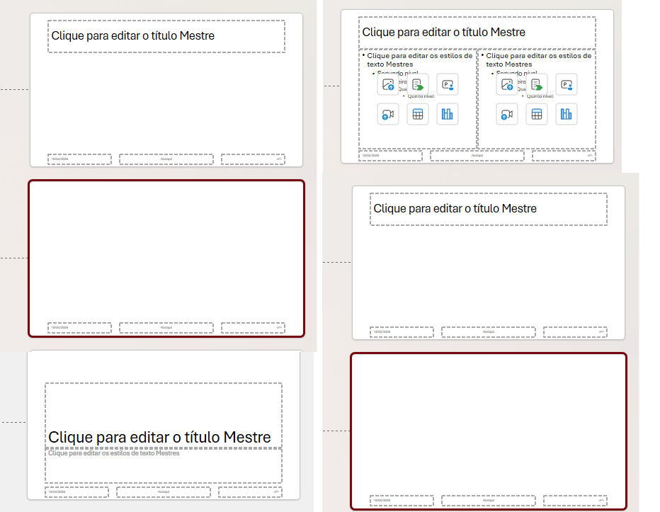

# Syntax Gallery - MD -> PPTX

> Converta Markdown em apresentacoes PowerPoint profissionais, diretamente no browser. Sem servidores, sem instalacao - tudo client-side.



## Funcionalidades

- **Editor em tempo real** - CodeMirror com syntax highlighting para Markdown
- **Live Preview 16:9** - renderizacao fiel via Marp, atualizada a cada keystroke
- **Geracao PPTX no browser** - PptxGenJS gera o arquivo sem enviar dados a servidores
- **5 layouts de slide** - selecionaveis por diretiva Markdown
- **Suporte a rich text** - negrito, italico, codigo inline, listas, tabelas, blockquotes, imagens e blocos de codigo
- **Diagramas Mermaid** - preview via SVG e export PPTX preservando o embed vetorial
- **Auto-shrink de fonte** - reduz automaticamente o tamanho se o conteudo nao couber
- **Alerta de overflow** - avisa quais slides ultrapassaram a altura antes do download
- **Templates .pptx** - carregue um arquivo como Slide Master
- **Export PDF + modo apresentacao** - fluxo de impressao e fullscreen no browser
- **Multiplos projetos + compartilhamento por URL** - persistencia local e hash compartilhavel
- **PWA** - funciona offline apos a primeira visita
- **109 testes automatizados** - cobertura das funcoes criticas

## Layouts de Slide

Adicione `<!-- layout: TIPO -->` em qualquer ponto do slide para selecionar o layout:

| Tipo | Descricao |
|------|-----------|
| `default` | Titulo no topo, conteudo abaixo *(padrao)* |
| `two-column` | Titulo + duas colunas divididas por `<!-- col -->` |
| `blank` | Conteudo preenche o slide inteiro, sem titulo destacado |
| `title-only` | So o titulo, centralizado verticalmente |
| `caption` | Conteudo ou imagem no topo, titulo como legenda no rodape |

```markdown
# Slide padrao

Conteudo normal abaixo do titulo.

---

<!-- layout: two-column -->
# Comparativo

Coluna da esquerda com texto livre.

<!-- col -->

Coluna da direita com listas:
- Item A
- Item B

---

<!-- layout: blank -->

Slide totalmente livre, sem area de titulo reservada.

---

<!-- layout: title-only -->

# Uma Frase de Impacto

---

<!-- layout: caption -->


# Fonte: Relatorio Anual 2024
```

## Sintaxe Markdown Suportada

```markdown
# Titulo principal (h1)
## Subtitulo (h2)

Paragrafo com **negrito**, _italico_ e `codigo inline`.

- Lista nao ordenada
- Com **formatacao** dentro

1. Lista ordenada
2. Numerada automaticamente

> Blockquote para citacoes ou destaques

| Coluna A | Coluna B |
|----------|----------|
| Dado 1   | Dado 2   |

```python
def hello():
    print("Hello, World!")
```


---  <- separador de slides
```

## Stack Tecnica

| Camada | Tecnologia |
|--------|-----------|
| Build | Vite + TypeScript |
| Editor | CodeMirror 6 |
| Preview | Marp Core |
| Parser MD | Unified / Remark + remark-gfm |
| Geracao PPTX | PptxGenJS |
| Sanitizacao | DOMPurify |
| Testes | Vitest + jsdom |
| PWA | vite-plugin-pwa |

## Inicio Rapido

```bash
# Instalar dependencias
npm install

# Servidor de desenvolvimento (http://localhost:5173)
npm run dev

# Build de producao
npm run build

# Executar testes
npm test

# Testes com cobertura
npm run test:coverage
```

## Estrutura do Projeto

```text
md-pptx/
|-- src/
|   |-- main.ts          # Ponto de entrada, orquestracao da UI
|   |-- converter.ts     # Parser MD -> PPTX (PptxGenJS)
|   |-- preview.ts       # Renderizacao Marp + CSS de layouts
|   |-- mermaid.ts       # Render Mermaid -> SVG
|   |-- layout-directives.ts # Parser compartilhado de diretivas de layout
|   |-- editor.ts        # Setup do CodeMirror
|   |-- template.ts      # Carregamento de templates .pptx
|   |-- style.css        # Estilos globais
|   `-- __tests__/       # 109 testes automatizados
|       |-- converter.test.ts
|       |-- converter.images.test.ts
|       |-- editor.test.ts
|       |-- preview.test.ts
|       `-- template.test.ts
|-- index.html
|-- vite.config.ts
|-- vitest.config.ts
`-- tsconfig.json
```

## Como Usar

1. Abra a aplicacao no browser.
2. Escreva ou cole seu Markdown no editor.
3. Visualize o preview ao vivo.
4. Opcionalmente, carregue um arquivo `.pptx` como template via botao **Template**.
5. Clique em **Export** para baixar o arquivo `.pptx`.

## Validacao Visual

Use os arquivos em `samples/` para validar preview e exportacao PPTX em cenarios reais:

- `samples/01-pitch-deck.md`
- `samples/02-tutorial-typescript.md`
- `samples/03-relatorio-dados.md`
- `samples/04-design-system.md`
- `samples/05-retrospectiva.md`

O checklist operacional e a tabela de resultado ficam em `docs/superpowers/specs/2026-04-19-sample-slides-design.md`.

## Licenca

MIT
