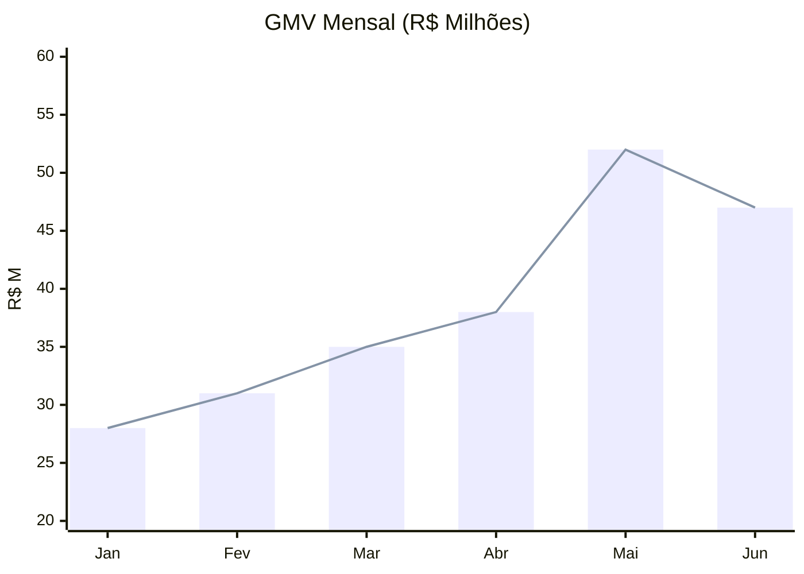
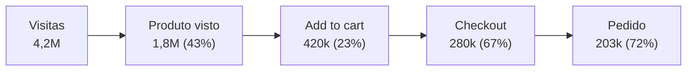

# Relatório de Performance
## Q2 2025 — Plataforma de E-commerce

*Confidencial · Uso interno*

---

# Resumo Executivo

O segundo trimestre registrou **crescimento de 34%** em GMV versus Q1, impulsionado pela campanha de mid-year e expansão de categorias. Desafios em logística impactaram NPS em Junho.

| KPI             | Meta Q2 | Real Q2 | vs Q1    |
|-----------------|---------|---------|----------|
| GMV             | R$ 42M  | R$ 47M  | +34%     |
| Pedidos         | 180k    | 203k    | +28%     |
| Ticket médio    | R$ 233  | R$ 231  | −0,9%    |
| NPS             | 65      | 58      | −7 pts   |

---

<!-- layout: two-column -->

# Receita por Canal

Crescimento orgânico superou paid em volume, mas paid mantém maior ticket.

<!-- col -->

## Canal Orgânico
- SEO: R$ 18,2M (+41%)
- Direto: R$ 9,1M (+22%)
- E-mail: R$ 4,8M (+18%)
- **Total: R$ 32,1M**

## Canal Pago
- Google Ads: R$ 8,4M
- Meta Ads: R$ 4,2M
- Influencer: R$ 2,3M
- **Total: R$ 14,9M**

---

# Evolução Mensal de GMV

---

# Funil de Conversão

---

# Top 10 Categorias

| Categoria        | GMV (R$) | Pedidos | Ticket Médio | Crescimento |
|------------------|----------|---------|--------------|-------------|
| Eletrônicos      | 14,2M    | 28.400  | R$ 500       | +52%        |
| Casa & Jardim    | 8,7M     | 52.100  | R$ 167       | +38%        |
| Moda             | 7,1M     | 71.000  | R$ 100       | +21%        |
| Esporte          | 5,4M     | 30.000  | R$ 180       | +44%        |
| Beleza           | 4,2M     | 42.000  | R$ 100       | +29%        |
| Pet              | 2,8M     | 28.000  | R$ 100       | +67%        |
| Livros           | 1,9M     | 38.000  | R$ 50        | +12%        |
| Games            | 1,4M     | 7.000   | R$ 200       | +88%        |
| Automotivo       | 0,8M     | 4.000   | R$ 200       | +5%         |
| Outros           | 0,5M     | 2.500   | R$ 200       | −3%         |

---

<!-- layout: two-column -->

# Análise de NPS

Queda de 7 pontos em Junho concentrada em reclamações de prazo de entrega.

<!-- col -->

## Promotores (9-10)
- 41% dos respondentes
- Elogio principal: variedade e preço
- Recomendam ativamente

## Detratores (0-6)
- 24% dos respondentes
- Reclamação principal: atraso na entrega
- Pico em 15-22/Jun (greve transportadoras)

---

<!-- layout: blank -->

# Próximas Ações — Q3

1. **Logística** — Contrato com 3 novas transportadoras (meta: +20% capacidade)
2. **NPS** — Programa de recuperação proativa para detratores de Junho
3. **Expansão** — Lançar categoria Alimentos & Bebidas (estimativa: +R$ 4M GMV)
4. **Tecnologia** — A/B test do novo checkout (meta: +5 pp conversão)

---

<!-- layout: caption -->

> O crescimento de 34% em GMV demonstra a robustez do modelo. O desafio logístico de Junho é pontual e já está sendo endereçado.

# Performance Q2 2025
